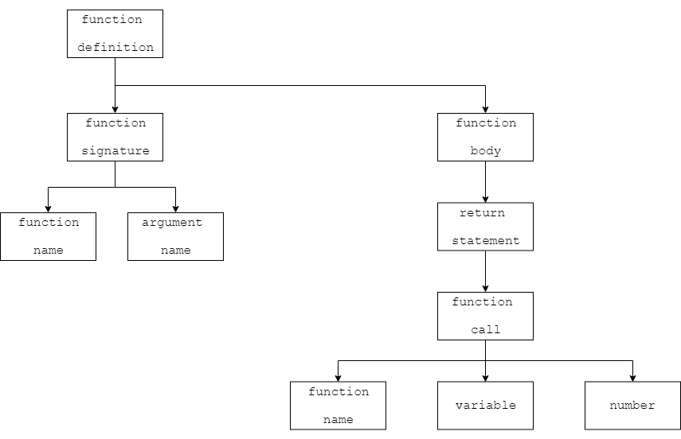

*****************
Language Pipeline
*****************

Here is how Subduce is processed and ran:

#. Source code

    * The source code is the .sbd file that you write.
    * It is read from file when you run the program.

#. Lexer

    * The Lexer scans the source code, and converts the raw code into a list of tokens that is more easily processed by the Parser
    * Tokens are like the atoms of the code. They are usually more than individual characters, and less than expressions.
    * Tokens contain information like the type of token, the line number, where it starts and ends, and the value, if applicable. 
    * An example of a token is ``<identifier> at 1:6-10. value: add1``. This token is an identifier (variable or function name) on line 1, from characters 6 to 10, with the name "add1".
    * Some syntax errors are detected at this stage

#. Parser

    * The parser takes the list of tokens, and generates a parsing tree. A parsing tree is a more high-level representation of what's going on in the code.
    * A parsing tree is composed of tokens.
    * There is an example of a parsing tree below.
    * This is the last part where syntax errors are checked for

#. Interpreter

    * The interpreter takes the parsing tree, and runs it.
    * The parsing tree is processed in python and is used to run the code.
    * Runtime errors are detected at this step

Example
=======

Here is an example of the process of running a simple program:

Source Code
-----------

.. code-block:: scheme

    def (add1 x):
        return (+ x 1)

Lexer
-----
::

    <start file> at 1
    <keyword> at 1:1-4. value: def
    <start function> at 1:5-6
    <identifier> at 1:6-10. value: add1
    <identifier> at 1:11-12. value: x
    <end function> at 1:12-13
    <end signature> at 1:13-14
    <newline> at 2
    <indent> at 2
    <keyword> at 2:2-8. value: return
    <start function> at 2:9-10
    <identifier> at 2:10-11. value: +
    <identifier> at 2:12-13. value: x
    <number> at 2:14-15. value: 1
    <end function> at 2:15-16
    <end file> at 3

Parser
------

Interpreter
-----------

At this point, the interpreter will run the code. It will define the function, and then stop. If there are print statements, this is when they would run and print things
